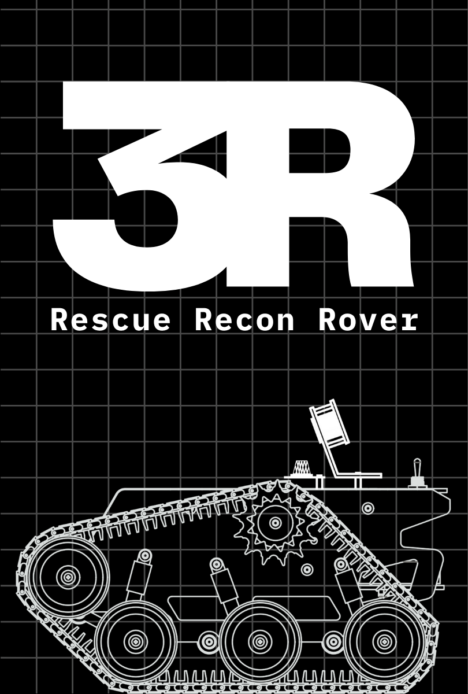

<h1 align="center">Hyunjae Lee — One-Page Works</h1>

<table width="100%" cellpadding="0" cellspacing="0" style="border-collapse:collapse; table-layout:fixed;">
  <!-- 1행: 포스터 이미지 -->
  <tr>
    <td></td>
    <td></td>
    <td></td>
    <td></td>
    <td></td>
    <td></td>
  </tr>

  <!-- 2행: 제목 -->
  <tr>
    <td align="center"><a href="#"><strong><em>Rescue Recon Rover</em></strong></a></td>
    <td align="center"><a href="#"><strong><em>Digital Fortune Cookie</em></strong></a></td>
    <td align="center"><a href="#"><strong><em>Pintos (x86-64)</em></strong></a></td>
    <td align="center"><a href="#"><strong><em>KlickLab</em></strong></a></td>
    <td align="center"><a href="#"><strong><em>PhantomFlow</em></strong></a></td>
    <td align="center"><a href="#"><strong><em>Project L</em></strong></a></td>
  </tr>

  <!-- 3행: 날짜 -->
  <tr>
    <td align="center">2023.11</td>
    <td align="center">2024.01</td>
    <td align="center">2024.04</td>
    <td align="center">2024.06</td>
    <td align="center">2024.07</td>
    <td align="center">2024.08</td>
  </tr>

  <!-- 4행: Article / Notes -->
  <tr>
    <td align="center"><a href="#">Write-up</a></td>
    <td align="center"><a href="#">Article</a></td>
    <td align="center"><a href="#">Notes</a></td>
    <td align="center"><a href="#">Architecture</a></td>
    <td align="center"><a href="#">Article</a></td>
    <td align="center"><a href="#">Roadmap</a></td>
  </tr>
</table>

