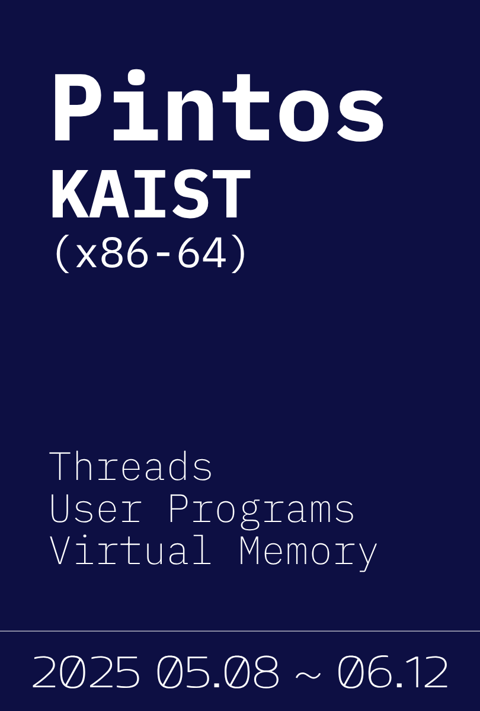
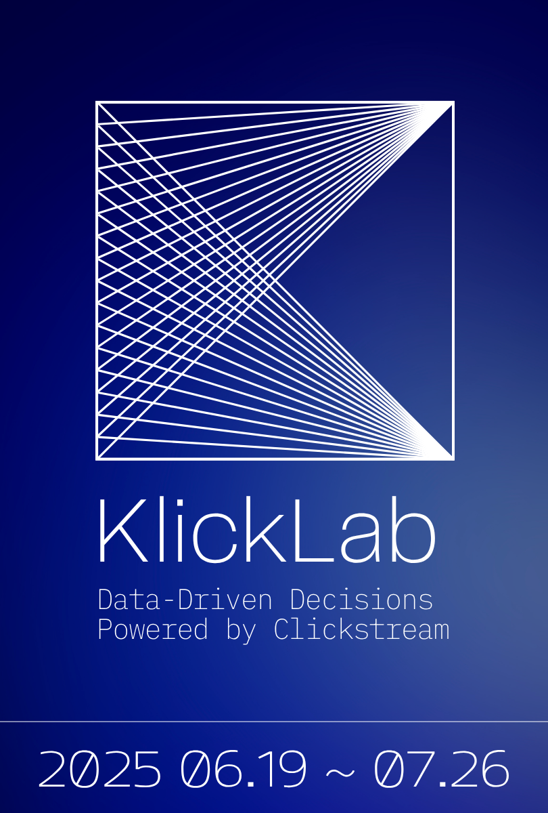
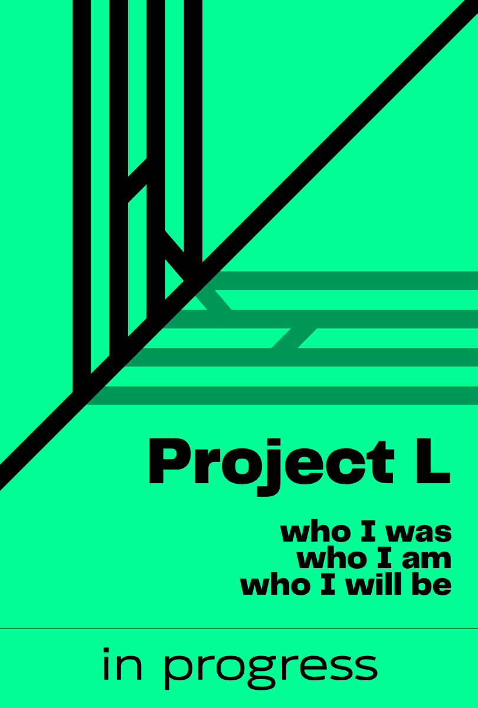

<h1 align="center">Hyunjae Lee — One-Page Works</h1>

<table>
  <!-- 1행: 이미지 -->
  <tr>
    <td align="center" width="180"></td>
    <td align="center" width="180"></td>
    <td align="center" width="180"></td>
    <td align="center" width="180"></td>
    <td align="center" width="180"></td>
    <td align="center" width="180"></td>
  </tr>

  <!-- 2행: 제목 (크게) -->
  <tr>
    <td align="center"><h3 style="margin:0;">3R — Rescue Recon Rover</h3></td>
    <td align="center"><h3 style="margin:0;">Digital Fortune Cookie</h3></td>
    <td align="center"><h3 style="margin:0;">PintOS (x86-64)</h3></td>
    <td align="center"><h3 style="margin:0;">KlickLab</h3></td>
    <td align="center"><h3 style="margin:0;">PhantomFlow</h3></td>
    <td align="center"><h3 style="margin:0;">Project L</h3></td>
  </tr>

  <!-- 3행: Repository 링크 -->
  <tr>
    <td align="center"><a href="#">Repository</a></td>
    <td align="center"><a href="#">Repository</a></td>
    <td align="center"><a href="#">Repository</a></td>
    <td align="center"><a href="#">Repository</a></td>
    <td align="center"><a href="#">Repository</a></td>
    <td align="center"><a href="#">Repository</a></td>
  </tr>

  <!-- 4행: Article / Notes 링크 -->
  <tr>
    <td align="center"><a href="#">Write-up</a></td>
    <td align="center"><a href="#">Article</a></td>
    <td align="center"><a href="#">Notes</a></td>
    <td align="center"><a href="#">Architecture</a></td>
    <td align="center"><a href="#">Article</a></td>
    <td align="center"><a href="#">Roadmap</a></td>
  </tr>
</table>
