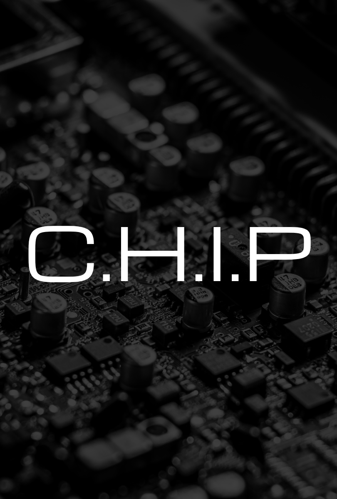

<h1 align="center">Hyunjae Lee — Project Collection</h1>
<p align="center"><em>Click on any image to visit its repository.</em></p>

<table width="100%" cellpadding="0" cellspacing="0" style="border-collapse:collapse; table-layout:fixed;">
  <!-- 1행 -->
  <tr>
    <td width="25%"><a href="https://github.com/At-this-moment/Rescue-Recon-Rover"></a></td>
    <td width="25%"><a href="https://github.com/At-this-moment/KRAFTON-JUNGLE-W0-Digital-Fortune-Cookie"></a></td>
    <td width="25%"><a href="https://github.com/Computer-Hardware-Industry-Perspective/CHIP"></a></td>
    <td width="25%"><a href="https://github.com/At-this-moment/KRAFTON-JUNGLE-W9-PintOS-Threads"></a></td>
  </tr>
  <tr>
    <td align="center"><a href="https://github.com/At-this-moment/Rescue-Recon-Rover"><strong>Rescue Recon Rover</strong></a></td>
    <td align="center"><a href="https://github.com/At-this-moment/KRAFTON-JUNGLE-W0-Digital-Fortune-Cookie"><strong>Digital Fortune Cookie</strong></a></td>
    <td align="center"><a href="https://github.com/Computer-Hardware-Industry-Perspective/CHIP"><strong>CHIP</strong></a></td>
    <td align="center"><a href="https://github.com/At-this-moment/KRAFTON-JUNGLE-W9-PintOS-Threads"><strong>Pintos (x86-64)</strong></a></td>
  </tr>

  <!-- 2행 -->
  <tr>
    <td width="25%"><a href="https://github.com/At-this-moment/KRAFTON-JUNGLE-W14-Lightningboard"></a></td>
    <td width="25%"><a href="https://github.com/Eatventory"></a></td>
    <td width="25%"><a href="https://github.com/Eatventory/PhantomFlow"></a></td>
    <td width="25%"><a href="https://github.com/At-this-moment/Project-L"></a></td>
  </tr>
  <tr>
    <td align="center"><a href="https://github.com/At-this-moment/KRAFTON-JUNGLE-W14-Lightningboard"><strong>Lightning</strong></a></td>
    <td align="center"><a href="https://github.com/Eatventory"><strong>KlickLab</strong></a></td>
    <td align="center"><a href="https://github.com/Eatventory/PhantomFlow"><strong>PhantomFlow</strong></a></td>
    <td align="center"><a href="https://github.com/At-this-moment/Project-L"><strong>Project L</strong></a></td>
  </tr>
</table>


```text                                                                         
              .@@@@@@@@=                                                  *@@@@@@@@+   
           @@@@@@@@@@@@@@@@                                                %@@@@@@@@@@@%:    .:=++-.            
         @@@@@@@@@@@@@@@@@@@@                                                @@@@@%..-@@@@@@@@@@@@@@%*=:        
        @@@@@@@@@@@@@@@@@@@@@@:                                                @@@@-    =@@@@@@@@@@@@@@@*=           
       @@@@@@@@@@@@@@@@@@@@@@@@            @@                                    @@@@. =@@@@@@@@@@@@@@@@@@#.     
      @@@@@@@@@@@@@@@@@@@@@@@@@@           @@@@@@@@@@+                             *@@@@@@@@@@@@@@@@@@@@@@@#.
      @@@@@@@@@@@@@@@@@@@@@@@@@@           @@@@@@@@@@@@@@@@@=                         @@@@@@@@@@@@@@@@@@@@@@%    
      @@@@@@@@@@@@@@@@@@@@@@@@@@           @@@@@@@@@@@@@@@@@@@@@+                     .%@@@@@@@@@@@@@@@@@@@@%     
      @@@@@@@@@@@@@@@@@@@@@@@@@@           @@@@@@@@@@@@@@*                             +@@@@@@@@@@@@@@@@@@@@%@*    
       @@@@@@@@@@@@@@@@@@@@@@@@*           @@@@@@                                       *%@@@@@@@@@@@@@@@@@@-@@@@
       @@@@@@@@@@@@@@@@@@@@@@@@                                                          +#@@@@@@@@@@@@@@@@=   @@@@
        :@@@@@@@@@@@@@@@@@@@@@                                                             +#%@@@@@@@@@@@@@:  ..@@@@@.
          @@@@@@@@@@@@@@@@@@                                                                 .-**#####+. *@@@@@@@@@@@@@
             @@@@@@@@@@@@=                                                                                   .@@@@@@@@@@
                                                                                                                   .%@@@
````

</div>
