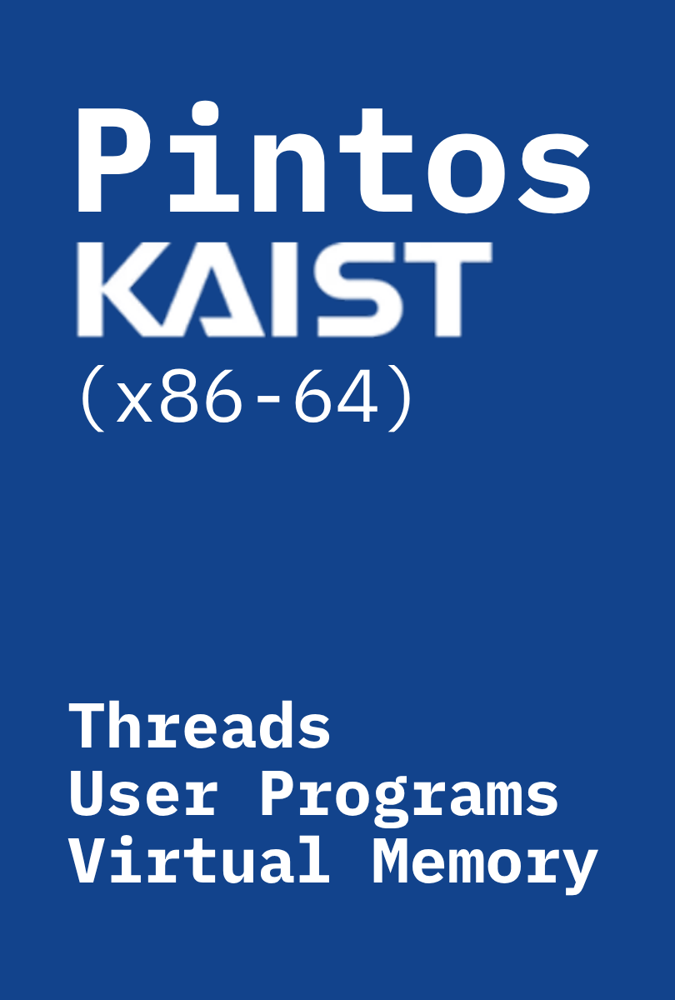

<h1 align="center">Hyunjae Lee — One‑Page Works</h1>

<table>
  <tr>
    <td align="center" width="240">
       
      <strong>3R — Rescue Recon Rover</strong> 
      2022‑09‑07 ~ 2022‑11‑04 
      <a href="<!-- 프로젝트 리포 링크 -->">Repository</a> ·
      <a href="<!-- 소개/회고 링크 -->">Write‑up</a>
    </td>
    <td align="center" width="240">
       
      <strong>Digital Fortune Cookie</strong> 
      2025‑03‑10 ~ 2025‑03‑13 
      <a href="<!-- 리포 링크 -->">Repository</a> ·
      <a href="<!-- 벨로그 링크 -->">Article</a>
    </td>
    <td align="center" width="240">
       
      <strong>KlickLab</strong> 
      2025‑06‑19 ~ 2025‑07‑26 
      <a href="https://github.com/At-this-moment/KlickLab">Repository</a> ·
      <a href="<!-- 아키텍처 글 링크 -->">Architecture</a>
    </td>
  </tr>
  <tr>
    <td align="center" width="240">
       
      <strong>PhantomFlow</strong> 
      2025‑07‑17 ~ 2025‑07‑26 
      <a href="https://github.com/At-this-moment/PhantomFlow">Repository</a> ·
      <a href="<!-- 벨로그 링크 -->">Article</a>
    </td>
    <td align="center" width="240">
       
      <strong>PintOS (x86‑64)</strong> 
      2025‑05‑08 ~ 2025‑06‑12 
      <a href="https://github.com/At-this-moment/PintOS">Repository</a> ·
      <a href="<!-- 구현 정리 링크 -->">Notes</a>
    </td>
    <td align="center" width="240">
       
      <strong>Project L</strong> 
      in progress 
      <a href="<!-- 리포/로드맵 링크 -->">Roadmap</a>
    </td>
  </tr>
</table>

<!-- 포스터는 9:16 비율 이미지. width만 고정하면 GitHub가 세로 비율을 자동 유지합니다. -->
